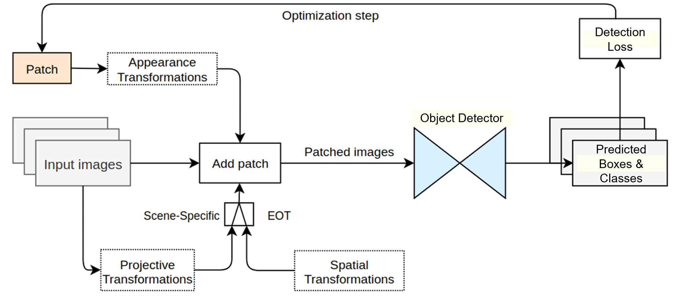

# YOLOv8 Adversarial Patch 

Implementation and evaluation of **adversarial patch attacks** on YOLOv8 object detection in a simulated driving environment, featuring an **Expectation Over Transformation (EOT)** patch generation pipeline and a **Local Gradient Smoothing (LGS)** defense.

This project explores how **physical adversarial patches** can disrupt object detection systems in autonomous driving scenarios, and investigates defenses to improve robustness.

---

##  Dataset

- **Source:** [CARLA-GEAR](https://arxiv.org/abs/2301.01680) — *CARLA-GEAR: A Dataset Generator for a Systematic Evaluation of Adversarial Robustness of Deep Learning Vision Models* (Yaman *et al.*, 2023).  
- **Format Conversion:** Original annotations were provided in **COCO JSON** format. We converted them into **YOLO format** for compatibility with Ultralytics YOLOv8 using a custom conversion script.  
- **Scenarios Used:** Adversarial billboard scenes (`billboard01`–`billboard09`) and clean (no billboard) driving scenes.

---

##  Adversarial Patch Generation

The patch generation follows the **Expectation Over Transformation (EOT)** framework, ensuring robustness under:

- **Spatial transformations:** scaling, rotations, translations  
- **Projective transformations:** perspective changes for realism  
- **Appearance transformations:** brightness, contrast, noise

##  Adversarial Patch Generation Pipeline (EOT-based)



1. **Patch Initialization**  
   - Start with a randomly initialized patch or a pre-trained design.

2. **Appearance Transformations** *(applied to patch)*  
   - Adjust brightness and contrast  
   - Add Gaussian noise  
   - Apply color changes to improve robustness

3. **Input Images**  
   - Source: dataset images (e.g., CARLA-GEAR driving scenarios).

4. **Scene-Specific Transformations (Expectation Over Transformation - EOT)**  
   - **Spatial Transformations**: random scaling, rotation, and translation  
   - **Projective Transformations**: perspective warping to match billboard angles

5. **Add Patch to Scene**  
   - Overlay transformed patch onto scene elements (billboards in this project).

6. **Patched Images → Object Detector**  
   - YOLOv8 processes patched images.

7. **Detection Output**  
   - Bounding boxes and class predictions generated.

8. **Detection Loss Computation**  
   - Compare predictions to ground truth  
   - Loss is used to guide optimization.

9. **Optimization Step**  
   - Backpropagation updates the patch to **maximize detection errors** (false positives/negatives

## Method Adaptation

This implementation builds on the **Expectation Over Transformation (EOT)** patch generation approach introduced in:

> M. Delbracio, B. O’Neal, A. Kirillov, and P. Milanfar. *Adversarial patches for physical-world attacks on object detection: a study on CARLA and robustness*. arXiv preprint arXiv:2201.01850, 2022.

**Key differences from the original method:**
- **Original PatchAttackTool**  
  - Designed primarily for **semantic segmentation** tasks  
  - Compares model predictions to **ground truth segmentation labels** to compute loss  

- **Our Adaptation**  
  - Designed for **object detection** (YOLOv8)  
  - Operates **without access to ground truth labels**  
  - Uses the **detector’s own predictions** (bounding boxes + confidence scores)  

## Loss Function — Maximizing False Positives

The adversarial objective in this project was to **increase the number of detected objects**, causing the YOLOv8 model to produce false positives.

The loss function was adapted from the PatchAttackTool method, but instead of minimizing the confidence for the correct class (as in targeted attacks), it **maximizes the objectness scores** of detections:

\[
\mathcal{L} = -\sum_{i=1}^{N} \log(s_i + \epsilon)
\]

Where:
- \( s_i \) = objectness confidence score for the *i*-th detection
- \( \epsilon \) = small constant for numerical stability

**Goal:** Push the detector to report spurious detections, degrading reliability in autonomous driving scenarios.

##  Local Gradient Smoothing (LGS) Defense

After generating the optimal adversarial patch, we applied **Local Gradient Smoothing (LGS)** — a preprocessing defense that reduces the impact of high-frequency adversarial noise while preserving image content.

- **Goal:** Reduce patch-induced false positives/negatives  
- **Trade-off:** Improves robustness but may slightly reduce clean accuracy  
- **Evaluation:** Compared detection results before and after applying LGS  

---

##  Results

- **Without defense:** Significant accuracy drop due to patch-induced false detections  
- **With LGS defense:** Improved detection performance on attacked images, showing a balance between accuracy and robustness  

---

##  Tools & Libraries

- **[Ultralytics YOLOv8](https://github.com/ultralytics/ultralytics)** – Object detection  
- **PyTorch** – Model training & optimization  
- **OpenCV** – Image processing  
- **Matplotlib** – Visualization  
- **NumPy** – Data manipulation  

---

##  Citation

**Dataset:**
```bibtex
@inproceedings{yaman2023carla,
  title={CARLA-GEAR: A Dataset Generator for a Systematic Evaluation of Adversarial Robustness of Deep Learning Vision Models},
  author={Yaman, Cemal and Humeniuk, Ivan and Pek, Christian and Dietmayer, Klaus},
  booktitle={2023 IEEE Intelligent Vehicles Symposium (IV)},
  year={2023},
  organization={IEEE}
}

